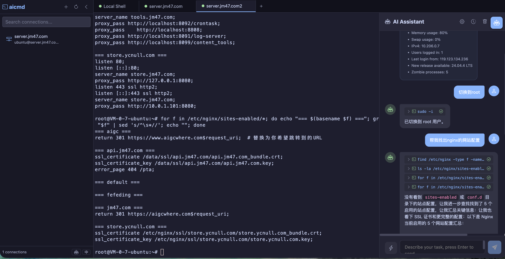

# AICmd

AI 驱动的 Web SSH 终端工具，将全功能终端仿真器与自主 AI Agent 结合。AI 能理解系统环境、执行命令、分析日志、管理服务 —— 一切通过自然语言对话完成。

## 功能特性

### AI Agent
- **自主操作**：AI Agent 通过工具调用（OpenAI function calling）直接在终端执行命令，观察输出、做出决策、迭代执行直到任务完成
- **系统感知**：首次连接时自动检测操作系统、CPU、内存、磁盘、已安装服务和可用语言，AI 始终了解当前系统环境
- **脚本生成**：复杂多步骤任务时，Agent 自动生成并执行脚本（Bash/Python/PowerShell），而非逐条运行命令
- **跨平台智能**：根据目标系统自动适配命令 —— Linux 用 `systemctl`、macOS 用 `launchctl`、Windows 用 `Get-Service`

### Skills 系统
- **内置 Skills**：预置常用运维操作模板：
  - 服务器健康检查 —— 全面采集系统指标
  - 日志分析 —— Python/awk 脚本进行错误模式检测
  - Docker 管理 —— 容器生命周期操作
- **自定义 Skills**：在 `~/.aicmd/skills/` 创建 markdown 文件，定义特定领域的 SOP、项目专属知识或任何 LLM 不具备的工作流
- **斜杠命令**：在聊天输入框中用 `/skill-name` 快速触发 Skill

### 终端
- **SSH 远程终端**：基于 xterm.js + ssh2 的完整 SSH 客户端，支持 256 色
- **本地 Shell**：通过 node-pty 提供原生本地 Shell（macOS/Linux 为 Bash/Zsh，Windows 为 PowerShell）
- **文件传输**：支持 rz/sz (ZMODEM) 文件上传下载，自动处理二进制数据
- **多会话管理**：基于标签页的多会话管理，状态跨重启持久化
- **自动重连**：SSH 断开后一键重连
- **会话持久化**：所有会话和对话历史在服务端持久化存储

### 通用功能
- **连接管理**：可视化的 SSH 连接配置（增删改查），支持密钥和密码认证
- **国际化**：中文/英文界面，运行时切换
- **桌面应用**：通过 NW.js 打包为跨平台桌面客户端
- **对话历史**：AI 对话历史持久化，支持跨会话浏览和恢复

## 截图



## 技术栈

| 层级 | 技术 |
|------|------|
| 前端 | Vue 3 + TypeScript + Vite + Bootstrap 5 + xterm.js |
| 后端 | Node.js + Express + WebSocket (ws) |
| SSH/PTY | ssh2 + node-pty |
| AI | OpenAI 兼容 API（支持任意兼容端点） |
| 构建 | Vite + TypeScript + nw-builder |

## 快速开始

### 安装

```bash
npm install -g @fefeding/aicmd
# 或
pnpm add -g @fefeding/aicmd
```

### 环境要求

- Node.js >= 18

### 启动服务

```bash
# 启动（默认端口 9802，自动寻找可用端口）
aicmd start

# 自定义端口
aicmd start --port 3000

# 停止 / 重启
aicmd stop
aicmd restart

# 查看版本
aicmd -v
```

然后在浏览器打开 http://localhost:9802。

### 配置 AI

1. 点击左下角侧边栏的机器人图标，或 AI 对话面板头部的齿轮图标
2. 输入 API Key 和 Base URL（支持 OpenAI、DeepSeek、通义千问或任何兼容 API）
3. 选择模型（默认 `gpt-4o-mini`）
4. 保存后开始对话

### 开发

```bash
# 克隆并安装
git clone <repo-url>
pnpm install

# 开发模式（热更新）
pnpm dev
# 访问 http://localhost:9801

# 构建
pnpm build          # 前端 + 服务端
pnpm build-server   # 仅服务端

# 生产启动
node server.js --port 3000
```

### 桌面应用（NW.js）

```bash
pnpm nw:dev          # 开发模式
pnpm nw:build        # 当前平台
pnpm nw:build:win    # Windows
pnpm nw:build:osx    # macOS
pnpm nw:build:linux  # Linux
```

## AI 使用示例

### 自然语言操作
```
你: 检查 nginx 是否在运行，并显示最近的错误日志
AI: [执行 systemctl status nginx，读取错误日志，提供分析]

你: 找出内存占用最高的 5 个进程
AI: [生成并运行 ps/sort 脚本，以表格展示结果]

你: 清理 7 天前的 Docker 镜像
AI: [运行 docker system prune 并过滤，报告释放的空间]
```

### 使用 Skills
```
你: /server-health-check
AI: [生成全面健康检查脚本，执行后分析所有指标]

你: /log-analyze /var/log/nginx/error.log
AI: [创建 Python 分析脚本，展示错误分布和模式]
```

### 自定义 Skill

创建 `~/.aicmd/skills/my-deploy.md`：
```markdown
---
name: 部署应用
description: 零停机部署生产应用
tags: [deploy, ops]
---

部署步骤：
1. 从 git 拉取最新代码
2. 运行数据库迁移
3. 构建资源文件
4. 使用 PM2 平滑重启
...
```

然后在对话中输入 `/deploy-my-app` 触发。

## 项目结构

```
.
├── bin/              # CLI 入口（aicmd 命令）
├── data/skills/      # 内置 AI Skills
├── dist/             # 构建产物
├── public/           # 静态资源
├── scripts/          # 构建脚本（NW.js）
├── server/           # 服务端源码（TypeScript）
│   ├── model/        # 实体定义
│   ├── service/      # 业务逻辑（AI、SSH、Skills）
│   └── index.ts      # 服务端入口
├── src/              # 前端源码（Vue 3）
│   ├── components/   # Vue 组件
│   │   ├── ai-chat/  # AI 对话面板
│   │   ├── ai-settings/ # AI 配置弹窗
│   │   └── ...       # 终端、侧边栏等
│   ├── locales/      # 国际化翻译
│   ├── service/      # 前端 API 服务
│   ├── stores/       # Pinia 状态管理
│   └── views/        # 页面视图
├── view/             # HTML 模板
└── server.js         # 生产环境启动
```

## 数据存储

所有数据本地存储在服务端：

| 数据 | 路径 |
|------|------|
| 连接配置 | `~/.aicmd/connections.json` |
| 会话数据 | `~/.aicmd/sessions.json` |
| AI 配置 | `~/.aicmd/ai-config.json` |
| 对话历史 | `~/.aicmd/ai-history/` |
| 用户 Skills | `~/.aicmd/skills/*.md` |

可通过 `AICMD_DATA_DIR` 环境变量自定义数据目录。

## 跨平台支持

终端和 AI Agent 支持以下平台：

| 平台 | Shell | AI 脚本 |
|------|-------|---------|
| Linux | bash/zsh | Bash + Python + Node.js |
| macOS | zsh/bash | Bash + Python + Node.js |
| Windows | PowerShell 7+/5.x | PowerShell + Python + Node.js |

AI Agent 自动检测目标系统并选择对应命令。

## 许可证

MIT
